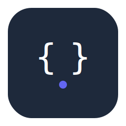
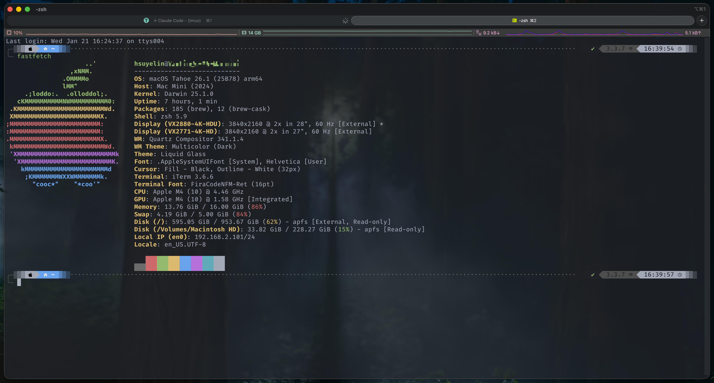
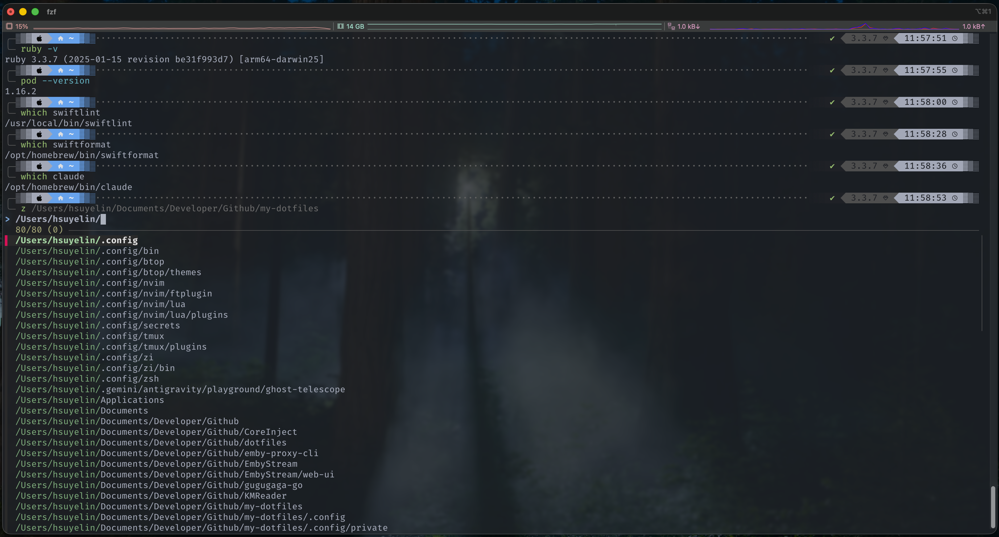
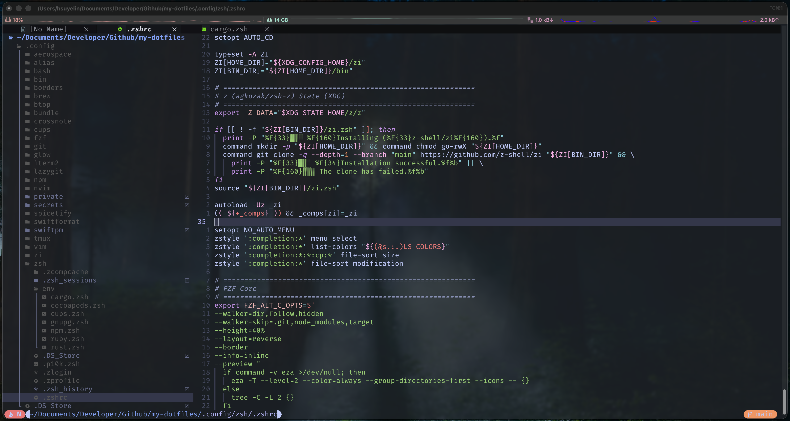
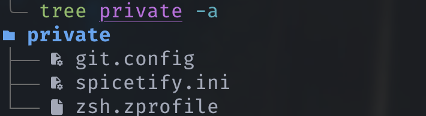
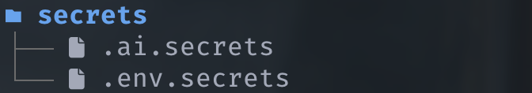
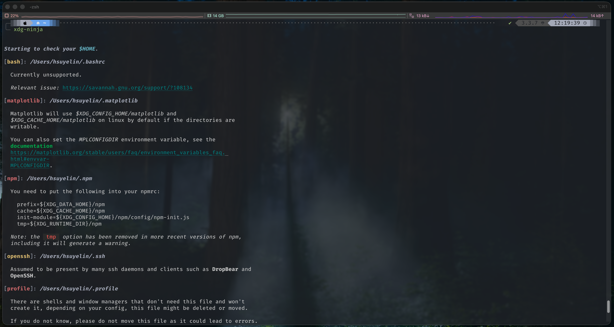

<p align="center">
  
</p>

<p align="center">
  <strong>Dotfiles</strong>
  <br />
  A personal macOS setup shared for reference and reuse.
</p>

<p align="center">
  <a href="#"></a>
  <a href="#"></a>
  <a href="#"></a>
  <a href="#"></a>
  <a href="#"></a>
  <br />
  <a href="LICENSE"></a>
</p>

---

<p align="center">
  <a href="README.md">English</a> · <a href="README_CN.md">中文</a>
</p>

> [!NOTE]
> * This repo is a production-tested personal setup. It’s published for reference and reuse, not as a one-size-fits-all installer.
> * Some parts are inspired by other great GitHub dotfiles, and others are based on my personal understanding. They may not be the most optimal or advanced, so please take them as a reference.

## Audience

This repo is for developers who want a reproducible macOS CLI stack with high leverage:

- A cohesive Zsh + tmux + Neovim workflow
- A consistent visual and interaction model across the terminal stack
- A pragmatic setup you can iterate on without losing track

If you want a general-purpose “one script installs everything for everyone” project, use this repo as a reference, not a drop-in solution.

## Reference machine



This is the machine these configs are primarily tuned and iterated on:

| Item | Value |
| --- | --- |
| OS | macOS 26.1 (Build 25B78) |
| Hardware | Apple M4 (Mac mini), 16 GB RAM |
| Shell | zsh 5.9 |
| Editor | Neovim 0.11.6 |
| Multiplexer | tmux 3.6a |
| Git | git 2.39.5 |

## Preview (iTerm2)


Daily workflow: common tool versions, binary paths, and `z` (zoxide + fzf) directory jump in action:



Neovim with Neo-tree sidebar, buffer tabs, and LSP-powered editing:



## iTerm2 configuration

This repo ships two iTerm2 assets:

| File | Description |
| --- | --- |
| [`iTerm2-template.json`](iTerm2-template.json) | Full profile (font, window, keys, colors, etc.) |
| [`one-dark-pro.itermcolors`](one-dark-pro.itermcolors) | Standalone One Dark Pro color preset |

Profile highlights:

| Setting | Value |
| --- | --- |
| Color scheme | One Dark Pro |
| Font | Fira Code Nerd Font Mono, 16pt |
| Window size | 110 columns x 35 rows |
| Transparency | ~20%, blur enabled |

**Import the full profile:**

1. Open iTerm2 → **Settings** → **Profiles**.
2. Click **Other Actions...** (bottom-left) → **Import JSON Profiles...**.
3. Select `iTerm2-template.json` and set as **Default** if desired.

**Import the color scheme only:**

If you already have your own iTerm2 profile and only want the One Dark Pro colors:

1. Open iTerm2 → **Settings** → **Profiles** → **Colors** tab.
2. Click **Color Presets...** (bottom-right) → **Import...**.
3. Select `one-dark-pro.itermcolors`, then choose **One Dark Pro** from the preset list.

<details>
<summary><strong>One Dark Pro palette reference</strong></summary>

| Role | Hex | Color |
| --- | --- | --- |
| Background | `#282C34` |  |
| Foreground | `#ABB2BF` |  |
| Black (ANSI 0) | `#21252B` |  |
| Red (ANSI 1) | `#E06C75` |  |
| Green (ANSI 2) | `#98C379` |  |
| Yellow (ANSI 3) | `#E5C07B` |  |
| Blue (ANSI 4) | `#61AFEF` |  |
| Magenta (ANSI 5) | `#C678DD` |  |
| Cyan (ANSI 6) | `#56B6C2` |  |
| White (ANSI 7) | `#ABB2BF` |  |
| Selection | `#323844` |  |

</details>

> [!TIP]
> The color scheme is also embedded in the profile JSON. If you prefer a different theme, either import a new `.itermcolors` file or replace the `Ansi *` / `Background` / `Foreground` color entries directly in the JSON.

## What’s included

- **Shell**: Zsh + [`zi`](https://wiki.zshell.dev) + [Powerlevel10k](https://github.com/romkatv/powerlevel10k)
- **Editor**: [Neovim](https://neovim.io) (Lua) with LSP/DAP and day-to-day plugins
- **Multiplexer**: [tmux](https://github.com/tmux/tmux) workflow + session persistence (`tmux-resurrect` / `tmux-continuum`)
- **Window management**: [AeroSpace](https://github.com/nikitabobko/AeroSpace) tiling + workspace routing
- **Git UX**: aliases + [`delta`](https://github.com/dandavison/delta) diffs + [`lazygit`](https://github.com/jesseduffield/lazygit)
- **File listing**: [`eza`](https://github.com/eza-community/eza) with icons and git status
- **Fuzzy finder**: [`fzf`](https://github.com/junegunn/fzf) + `fzf-tab` for history, files, and completion
- **Directory jump**: [`zoxide`](https://github.com/ajeetdsouza/zoxide) — frequency-based smart `cd`
- **Ruby toolchain**: [RVM](https://rvm.io) + CocoaPods (for iOS / macOS development)

## Philosophy

- Keep the terminal stack consistent (fonts, colors, keybindings)
- Prefer simple, composable tools over “magic”
- Make it easy to adopt incrementally (copy what you need)

## Repo layout

- `zsh/` — Zsh config (zi + Powerlevel10k)
- `nvim/` — Neovim (Lua)
- `tmux/` — tmux config
- `aerospace/` — AeroSpace config
- `git/` — Git config + aliases
- `alias/`, `bash/`, `bin/` — helpers and scripts
- `brew/` — Homebrew formulae and cask lists
- `docs/` — [structure](docs/STRUCTURE.md) and [quick start guide](docs/QuickStart.md)
- `install.sh` — one-command bootstrap for fresh Apple Silicon Macs

For the complete list of directories, see [`STRUCTURE.md`](docs/STRUCTURE.md).

## Compatibility

Designed for **macOS on Apple Silicon**. The bootstrap script (`install.sh`) targets `arm64` architecture exclusively. Other OSes or Intel Macs should treat this repo as a reference and adapt manually.

## Privacy

Keep anything personal or environment-specific in `secrets/` and `private/`.
Both are gitignored, so you won’t see my actual structure in this repo.
If you want a reference, see:

<p>
  
  
</p>

## Getting started

1. Clone this repo into `~/.config`.
2. Create any local-only files under `secrets/` and `private/`.
3. Restart your shell (or source configs) and iterate.

### Fresh machine setup

For a brand-new Apple Silicon Mac, clone the repo to any directory **outside** `~/.config` (the script will copy dotfiles into `~/.config` for you):

```bash
git clone https://github.com/hsuyelin/dotfiles.git ~/dotfiles
cd ~/dotfiles
chmod +x install.sh && ./install.sh
```

The script walks through the full setup in order: architecture check, iTerm2 installation, dotfiles copy, XDG directory creation, Homebrew, packages, Zsh, zi, RVM, Ruby, and CocoaPods. It is **idempotent** — every step checks current state before acting, and a built-in resume mechanism lets you pick up where you left off if something fails. See [`install.sh`](install.sh) for details.

### Quick start

Once the environment is ready, refer to the **[Quick Start Guide](docs/QuickStart.md)** for a cheat-sheet of the most-used aliases, keymaps, and commands across the stack (Git, Neovim, tmux, fzf, Ruby, etc.).

## How to reference this repo

If you want to borrow parts of this setup rather than adopt it wholesale:

1. **Scan the layout**: start with [`STRUCTURE.md`](docs/STRUCTURE.md) to locate the area you care about.
2. **Pick one surface**: shell, editor, tmux, or git — adopt a single layer at a time.
3. **Copy configs, not assumptions**: port the files you need, then adjust paths, fonts, and plugin lists for your system.
4. **Keep secrets local**: anything machine-specific belongs in `secrets/` or `private/`.
5. **Iterate in small steps**: apply a change, reload, and validate before moving on.

## Backup and XDG setup

Before adopting any configs, archive your existing setup:

1. **Create a snapshot**: move your current config into a dated backup folder.
2. **Identify common targets**: `~/.zshrc`, `~/.zprofile`, `~/.tmux.conf`, `~/.gitconfig`, and `~/.config/nvim`.
3. **Preserve local secrets**: SSH keys, tokens, and machine-specific files should stay outside the repo.

Suggested backup commands:

```bash
mkdir -p ~/dotfiles-backup/$(date +%Y%m%d)
mv ~/.zshrc ~/.zprofile ~/.tmux.conf ~/.gitconfig ~/dotfiles-backup/$(date +%Y%m%d)/ 2>/dev/null
mv ~/.config/nvim ~/dotfiles-backup/$(date +%Y%m%d)/ 2>/dev/null
```

[XDG Base Directory](https://wiki.archlinux.org/title/XDG_Base_Directory) is a freedesktop.org specification that standardizes where applications store config, data, state, and cache files. Instead of scattering dotfiles across `$HOME`, XDG consolidates them into a few well-defined directories, keeping your home directory clean and configs easy to back up or version-control.

This repo relies on the following XDG variables:

```bash
export XDG_CONFIG_HOME="$HOME/.config"
export XDG_DATA_HOME="$HOME/.local/share"
export XDG_STATE_HOME="$HOME/.local/state"
export XDG_CACHE_HOME="$HOME/.cache"
```

Place these in your shell profile (e.g. `~/.zprofile`) to ensure tools load configs from `~/.config`.

You can use [`xdg-ninja`](https://github.com/b3nj5m1n/xdg-ninja) to audit which files in your `$HOME` could be moved to XDG-compliant paths:

```bash
brew install xdg-ninja
xdg-ninja
```



> [!CAUTION]
> The suggestions from `xdg-ninja` are **for reference only**. Blindly migrating everything to XDG paths may cause unexpected issues with some tools. Always check the relevant community docs or upstream issue tracker before moving a specific config.

## Benefits & trade-offs

Benefits:

- A cohesive, production-grade terminal workflow with minimal drift over time
- Clear separation between shared configs and local secrets
- Incremental adoption; copy only what you need
- Easy to audit; everything is plain text and versioned

Trade-offs:

- Opinionated defaults; you will likely want to tune keybindings and plugins
- macOS-first; other OSes should treat this as a reference
- Existing configs can be overwritten if you merge without care
- Some tools assume Homebrew, so expect minor adjustments elsewhere

## Reference

- Structure overview: [`STRUCTURE.md`](docs/STRUCTURE.md)
- Quick start guide: [`QUICKSTART.md`](docs/QuickStart.md)
- Bootstrap script: [`install.sh`](install.sh)

## License

This repo is licensed under the MIT License. Use, copy, and modify freely. Please respect the MIT terms. See [`LICENSE`](LICENSE) for details.
