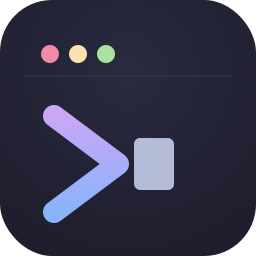

<p align="center">
  
</p>

<p align="center">
  <strong>Dotfiles</strong>
  <br />
  Personal macOS configuration for Apple Silicon —<br/>
  one-command bootstrap, XDG-compliant layout, unified <a href="https://github.com/catppuccin/catppuccin">Catppuccin Mocha</a> theme.
</p>

<p align="center">
  <a href="https://github.com/catppuccin/catppuccin"></a>
</p>

<p align="center">
  <a href="#"></a>
  <a href="#"></a>
  <a href="#"></a>
  <a href="#"></a>
  <a href="LICENSE"></a>
</p>

---

## Platform

Developed and tested exclusively on:

| | |
|---|---|
| **OS** | macOS Tahoe 26.3.1 |
| **Hardware** | Apple M4 (arm64) |
| **Architecture** | ARM64 — any Apple Silicon Mac (M1 and later) should work |

Intel Macs are **not** supported.

### Tool Versions

| Tool | Version |
|---|---|
| zsh | 5.9 |
| [Ghostty](https://ghostty.org) *(default terminal)* | 1.3.1 |
| [kitty](https://sw.kovidgoyal.net/kitty/) *(alternative terminal)* | 0.46.2 |
| [Starship](https://starship.rs) | 1.25.0 |
| [Neovim](https://neovim.io) | 0.12.2 |
| [tmux](https://github.com/tmux/tmux) | 3.6a |
| [lazygit](https://github.com/jesseduffield/lazygit) | 0.61.1 |
| [eza](https://github.com/eza-community/eza) | 0.23.4 |
| [bat](https://github.com/sharkdp/bat) | 0.26.1 |
| [fzf](https://github.com/junegunn/fzf) | 0.72.0 |
| [zoxide](https://github.com/ajeetdsouza/zoxide) | 0.9.9 |
| [delta](https://github.com/dandavison/delta) | 0.19.2 |
| [btop](https://github.com/aristocratos/btop) | 1.4.6 |

---

## Previews

<table>
  <tbody>
    <tr>
      <td align="center" width="50%">
        <video src="https://raw.githubusercontent.com/hsuyelin/dotfiles/refs/heads/main/assets/screenshots/ghostty.mp4" controls width="100%"></video>
        <br/>
        <strong>Ghostty — Terminal</strong><br/>
        <sub>Catppuccin Mocha · background blur · cursor warp shader</sub>
      </td>
      <td align="center" width="50%">
        <video src="https://raw.githubusercontent.com/hsuyelin/dotfiles/refs/heads/main/assets/screenshots/kitty.mp4" controls width="100%"></video>
        <br/>
        <strong>kitty — Terminal (alt)</strong><br/>
        <sub>Catppuccin Mocha · same font + keybinds as Ghostty</sub>
      </td>
    </tr>
    <tr>
      <td align="center" width="50%">
        
        <br/>
        <strong>Starship — Prompt</strong><br/>
        <sub>Catppuccin Mocha palette · git status · clock</sub>
      </td>
      <td align="center" width="50%">
        <video src="https://raw.githubusercontent.com/hsuyelin/dotfiles/refs/heads/main/assets/screenshots/neovim.mp4" controls width="100%"></video>
        <br/>
        <strong>Neovim — Editor</strong><br/>
        <sub>Lazy.nvim · LSP · Treesitter</sub>
      </td>
    </tr>
    <tr>
      <td align="center" width="50%">
        <video src="https://raw.githubusercontent.com/hsuyelin/dotfiles/refs/heads/main/assets/screenshots/aerospace.mp4" controls width="100%"></video>
        <br/>
        <strong>AeroSpace — Window Manager</strong><br/>
        <sub>Tiling · JankyBorders · vim-style workspace navigation</sub>
      </td>
      <td align="center" width="50%">
        
        <br/>
        <strong>btop — System Monitor</strong><br/>
        <sub>Catppuccin Mocha theme</sub>
      </td>
    </tr>
    <tr>
      <td align="center" width="50%">
        <video src="https://raw.githubusercontent.com/hsuyelin/dotfiles/refs/heads/main/assets/screenshots/lazygit.mp4" controls width="100%"></video>
        <br/>
        <strong>lazygit — Git TUI</strong><br/>
        <sub>Delta diff pager · full keyboard workflow</sub>
      </td>
      <td width="50%"></td>
    </tr>
  </tbody>
</table>

---

## Stack

| Layer | Tool | Notes |
|---|---|---|
| Shell | [zsh](https://www.zsh.org) + [zi](https://github.com/z-shell/zi) | XDG-compliant · lazy plugin loading |
| Plugins | fast-syntax-highlighting · zsh-autosuggestions · fzf-tab · zsh-eza | All lazy-loaded via zi |
| Prompt | [Starship](https://starship.rs) | Catppuccin Mocha palette |
| Terminal | [Ghostty](https://ghostty.org) *(default)* | Blur · CJK font map · cursor warp shader · quick terminal |
| Terminal (alt) | [kitty](https://sw.kovidgoyal.net/kitty/) | Same theme + keybinds; no cursor shader or quick terminal |
| Editor | [Neovim](https://neovim.io) | Lazy.nvim · LSP · Treesitter |
| Window Manager | [AeroSpace](https://github.com/nikitabobko/AeroSpace) | Tiling · vim-style keybinds |
| Window Borders | [JankyBorders](https://github.com/FelixKratz/JankyBorders) | Auto-launched by AeroSpace |
| File listing | [eza](https://github.com/eza-community/eza) | Replaces `ls` · icons · git status |
| Fuzzy finder | [fzf](https://github.com/junegunn/fzf) + [zoxide](https://github.com/ajeetdsouza/zoxide) | `z` for directory jumping |
| Diff pager | [delta](https://github.com/dandavison/delta) | Syntax-highlighted git diffs |
| Git TUI | [lazygit](https://github.com/jesseduffield/lazygit) | `lg` alias |
| Syntax highlight | [bat](https://github.com/sharkdp/bat) | Catppuccin Mocha theme |
| System monitor | [btop](https://github.com/aristocratos/btop) | Catppuccin Mocha theme |
| Markdown reader | [glow](https://github.com/charmbracelet/glow) | Terminal markdown renderer |
| Package manager | [Homebrew](https://brew.sh) | Formulae + casks declared in `brew/` |

---

## Install

### One-command bootstrap (fresh machine)

```bash
DOTFILES_REPO=https://github.com/hsuyelin/dotfiles \
  bash <(curl -fsSL https://raw.githubusercontent.com/hsuyelin/dotfiles/main/bootstrap.sh)
```

`bootstrap.sh` runs these steps in order:

1. Verify platform (macOS, ARM64)
2. Install Xcode Command Line Tools
3. Install Homebrew
4. Clone this repo to `~/.config`
5. **Prompt: select terminal** — Ghostty or kitty (30 s timeout → Ghostty)
6. Run `install.sh`
7. Install Homebrew formulae and casks from `brew/`
8. Install RVM

### Already have `~/.config` cloned?

```bash
bash ~/.config/install.sh
```

Idempotent — safe to re-run on an existing machine. Also prompts for terminal selection if neither Ghostty nor kitty is installed.

### Terminal selection

During install, you will see:

```
Select a terminal emulator:
  [1] Ghostty  (default — cursor shaders, quick terminal, full feature set)
  [2] kitty    (alternative — same Catppuccin Mocha theme, compatible keybinds)

Choice [1/2] (auto-selects Ghostty in 30 s):
```

Press `Enter` or wait 30 seconds to accept Ghostty. To skip the prompt entirely:

```bash
# Force Ghostty (non-interactive / CI-friendly)
bash bootstrap.sh --terminal=ghostty

# Force kitty
bash bootstrap.sh --terminal=kitty
```

To switch terminals after install, re-run with the desired flag — then follow the two-line swap in `aerospace/aerospace.toml` (instructions are in the file header).

### Options

| Flag | Applies to | Effect |
|---|---|---|
| `--dry-run` | both | Print what would happen, make no changes |
| `--terminal=ghostty` | both | Install Ghostty, skip kitty |
| `--terminal=kitty` | both | Install kitty, skip Ghostty |
| `--skip-rvm` | `bootstrap.sh` | Skip RVM installation |
| `--skip-rtk` | `install.sh` | Skip RTK (Rust Token Killer) |

---

## Post-Install Checklist

Fill in the gitignored private files created as stubs by `install.sh`:

```
~/.config/private/git.config       # git user.name, user.email, github.user
~/.config/secrets/.env.secrets     # environment secrets
~/.config/secrets/.ai.secrets      # AI API keys
```

Then:

- Open **tmux** → `<prefix>+I` to install plugins via TPM
- Open **Neovim** — Lazy.nvim installs plugins automatically on first launch
- Open **Ghostty** — cursor shader loads from `ghostty/shaders/`
- Install a Ruby version: `rvminstall 3.x.x`

---

## Directory Layout

```
~/.config/
├── aerospace/       # AeroSpace tiling WM
├── alias/           # Shell aliases
├── assets/          # Repository assets (logo, etc.)
├── bash/            # bash_profile, AI shell helpers
├── bat/             # bat config + Catppuccin Mocha theme
├── borders/         # JankyBorders config
├── brew/            # Homebrew formulae + casks lists
├── btop/            # btop config + Catppuccin Mocha theme
├── bundle/          # Bundler config
├── fzf/             # fzf shell integration
├── ghostty/         # Ghostty terminal config + cursor shaders (default)
├── kitty/           # kitty terminal config (alternative, mirrors Ghostty)
├── git/             # Global git config + commit template
├── glow/            # Glow markdown renderer config
├── lazygit/         # lazygit UI config
├── npm/             # npm XDG config
├── nvim/            # Neovim (Lazy.nvim)
├── starship/        # Starship prompt config
├── swiftformat/     # SwiftFormat rules
├── tmux/            # tmux config + TPM
├── zsh/             # .zshrc · .zshenv · .zprofile · env/
├── private/         # gitignored — personal identity (git name/email)
├── secrets/         # gitignored — API keys, tokens
├── bootstrap.sh     # Full machine setup (run once on new hardware)
└── install.sh       # Dotfiles installer (idempotent)
```

---

## Design Notes

**XDG compliance** — Everything lives under `~/.config`. A single `~/.zshenv` bootstraps `ZDOTDIR`; no scattered dotfiles in `$HOME`.

**Private by default** — `private/git.config` holds identity; `secrets/` holds credentials. Both are gitignored and stubbed by `install.sh`. The repo contains zero personal data.

**Theme consistency** — [Catppuccin Mocha](https://github.com/catppuccin/catppuccin) is the single theme applied uniformly across every tool: Ghostty, Starship, bat, btop, Neovim, and lazygit. Colors, contrast, and accent palette are identical everywhere — no visual context-switching between tools.

**Idempotency** — Every script is safe to re-run. Existing files are never overwritten; completed steps are logged and skipped.

---

## License

[MIT](LICENSE) © 2026 hsuyelin
